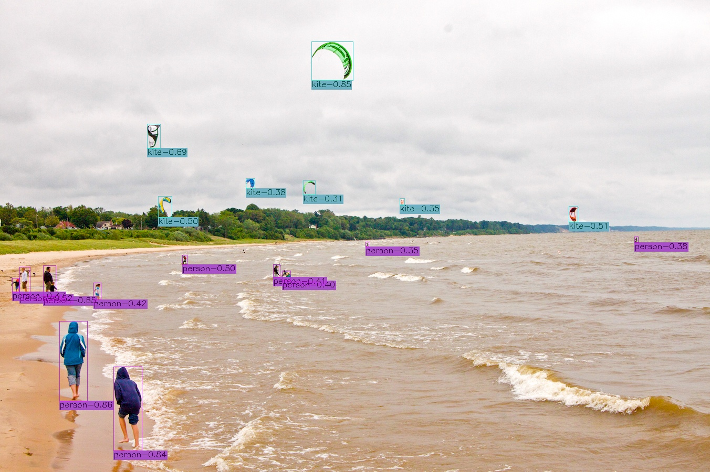

# EfficientDet
This is an implementation of [EfficientDet](https://arxiv.org/pdf/1911.09070.pdf) for object detection on Keras and Tensorflow. 
The project is based on the official implementation [google/automl](https://github.com/google/automl), [fizyr/keras-retinanet](https://github.com/fizyr/keras-retinanet), [qubvel/efficientnet](https://github.com/qubvel/efficientnet), and the [xuannianz/EfficientDet](https://github.com/xuannianz/EfficientDet).


## About pretrained weights
* The pretrained EfficientNet weights on imagenet are downloaded from [Callidior/keras-applications/releases](https://github.com/Callidior/keras-applications/releases)
* The pretrained EfficientDet weights on coco are converted from the official release [google/automl](https://github.com/google/automl).

Thanks for their hard work.
This project is released under the Apache License. Please take their licenses into consideration too when use this project.


# Usage
**Usage within Docker Container**
* Docker file is developed inside this repository along with .devcontainer folder. Please build the image and run inside bash environments.txt


**Usage in Python Environment**
* Create Python environment
* Then, to install the dependencies in created environments
```
pip install requirement
```
## Training

### Training for benchmark Datasets

**Build dataset** 
1. Pascal VOC 
    * Download VOC2007 and VOC2012, copy all image files from VOC2007 to VOC2012.
    * Append VOC2007 train.txt to VOC2012 trainval.txt.
    * Overwrite VOC2012 val.txt by VOC2007 val.txt.
2. MSCOCO 2017
    * Download images and annotations of coco 2017
    * Copy all images into datasets/coco/images, all annotations into datasets/coco/annotations

### Training for custom datasets

**Build dataset**

* I have used LableImg to label my dataset, therefore, the annotations are in XML format and will be converted into CSV format.
  * If you have not written your own script for XML -> CSV, then, a setup with different PY files is given in director (datasets/config_folder/..). 
    1. Python file "build_dataset.py" is the required script for XML -> CSV conversion.
    2. Place your annotations in annotation folder
    3. Place your images in images folder
    4. Follow the instruction written in "build_dataset.py" file to configure "config/paths_config.py" file for correct functionality either in Docker container or Python environment.
    5. Outputs of these scripts will be
        1. train.csv, val.csv, test.csv and classes.csv
  * Write your own script to generate CSV files of annotations with format
    1. Annotations format
       1. The CSV file with annotations should contain one annotation per line.
       2. Images with multiple bounding boxes should use one row per bounding box.
       3. Note that indexing for pixel values starts at 0.
       4. The expected format of each line is

       ```
       path/to/image.jpg,x1,y1,x2,y2,class_name
       ```

        5. Some images may not contain any labeled objects. To add these images to the dataset as negative examples, add an annotation where `x1`, `y1`, `x2`, `y2` and `class_name` are all empty:

        ``` 
        path/to/image.jpg,,,,, 
        ```

        A full example:

        ```
        /data/imgs/img_001.jpg,837,346,981,456,cow
        /data/imgs/img_002.jpg,215,312,279,391,cat
        /data/imgs/img_002.jpg,22,5,89,84,bird
        /data/imgs/img_003.jpg,,,,,
        ```
        
        6. This defines a dataset with 3 images.
        `img_001.jpg` contains a cow.
        `img_002.jpg` contains a cat and a bird.
        `img_003.jpg` contains no interesting objects/animals.


    2. Class mapping format:
        The class name to ID mapping file should contain one mapping per line.
        Each line should use the following format:

        ```
        class_name,id
        ```
        
        Indexing for classes starts at 0.
        Do not include a background class as it is implicit.

        For example:

        ```
        cow,0
        cat,1
        bird,2
        ```

**train**

```
python train.py --phi 1 --gpu 0 --random-transform --compute-val-loss --batch-size 3 --steps 1000 --epochs 500 csv path_to_train_files/train.csv path_to_classes_file/classes.csv --val-annotations-path path_to_val_dataset_file/val.csv
```

 1. If my dataset arrangement format has been followed and CSV fils has been generated with "build_dataset.py" then, please use the following command.
    ```
    python train.py --phi 1 --gpu 0 --random-transform --compute-val-loss --batch-size 3 --steps 1000 --epochs 500 csv datasets/config_folder/dataset/train.csv datasets/config_folder/dataset/classes.csv --val-annotations-path datasets/config_folder/dataset/val.csv
    ```

**Anchors Optimization**

Sometimes, the default anchor boxes are not suitable, therefore, the small objects can not be detected. To get rid of this problem, the anchor boxes can be optimized.
* Either use the anchor optimizations repository cloned in this implementation as "anchor-optimization-master" or follow the [anchor-optimization](https://github.com/martinzlocha/anchor-optimization/).

## Evaluate
1. PASCAL VOC
    * `python3 eval/common.py` to evaluate pascal model by specifying model path there.
    * The best evaluation results (score_threshold=0.01, mAP<sub>50</sub>) on VOC2007 test are: 

    | phi | 0 | 1 |
    | ---- | ---- | ---- |
    | w/o weighted |  | [0.8029](https://drive.google.com/open?id=1-QkMq56w4dZOTQUnbitF53NKEiNF9F_Q) |
    | w/ weighted | [0.7892](https://drive.google.com/open?id=1mrqL9rFoYW-4Jc57MsTipkvOTRy_EGfe) |  |
2. MSCOCO
    * `python3 eval/coco.py` to evaluate coco model by specifying model path there.
    
    | phi | mAP |
    | ---- | ---- |
    | 0 | 0.334 [weights](https://drive.google.com/open?id=1MNB5q6rJ4TK_gen3iriu8-ArG9jB8aR9), [results](https://drive.google.com/open?id=1U4Bdk4C7aNF7l4mvhh2Oi8mFpttEwB8s) |
    | 1 | 0.393 [weights](https://drive.google.com/open?id=11pQznCTi4MaVXqkJmCMcQhphMXurpx5Z), [results](https://drive.google.com/open?id=1NjGr3yG3_Rk1xVCk4sgVelTZNNz_E2vp) |
    | 2 | 0.424 [weights](https://drive.google.com/open?id=1_yXrOrY0FDnH-d_FQIPbGy4z2ax4aNh8), [results](https://drive.google.com/open?id=1UQP8kDj7tXHC2bs--Aq8x7w7FkVX4xJD) |
    | 3 | 0.454 [weights](https://drive.google.com/open?id=1VnxoBpEQmm0Z2uO3gjhYDeu-rNirba6c), [results](https://drive.google.com/open?id=1uruTEMPhl_JvbA_T9kCdutzeOR3gFX4g) |
    | 4 | 0.483 [weights](https://drive.google.com/open?id=1lQvTpnO_mfkHCRpcP28dxU4CWyK3xUzj), [results](https://drive.google.com/open?id=1s4nmgYaPqjbAgDlRF1AVVz6uWKDz7O_i) |

3. Custom Data (Testset)
    * Prepare the "test.csv" file
    * Arrange test images in the directory according to CSV annotation so that these could be accessible by "eveluate_model_mAP.py" file.
    * If you have used "build_dataset.py" file to generate all of your CSV files, then, "eveluate_model_mAP.py" has already been configured with directory paths.
    * Please specify the model path to use the weight matrix and model
    * Specify the corresponding "phi" value. For instance, 0 for EfficientDet D0, 1 for EfficientDet D1 etc.
## Test 

* Prepare the test image files in a folder
* "eveluate_model_image_output.py" has already been configured with directory paths.
* Please specify the model path to use the weight matrix and model
* Specify the corresponding "phi" value. For instance, 0 for EfficientDet D0, 1 for EfficientDet D1 etc.

[//]:  
